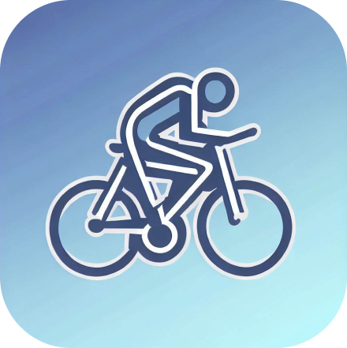
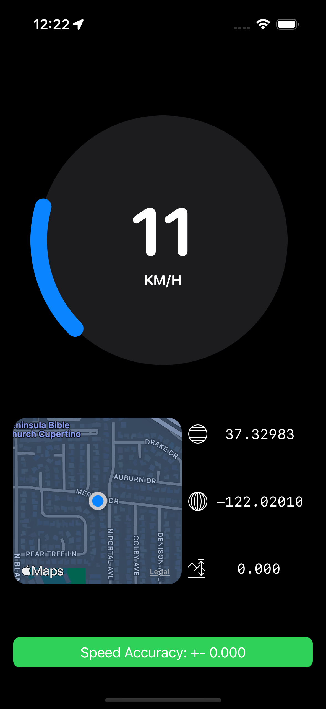
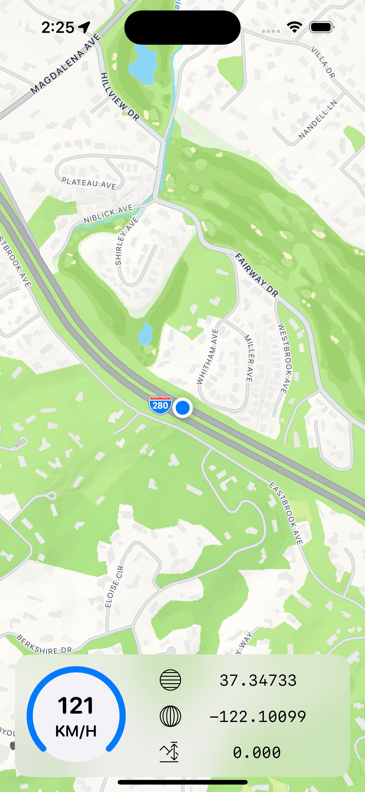

# Speedometer App - iOS Mobile Application

 <br/>
Temporary app icon generated by AI

## Overview

The Speedometer App is a mobile application for iOS devices written in Swift. The app provides a speedometer and other crucial informations for cyclists. It allows users to track their current speed while also showing them a map preview of their location and the corresponding coordinates (latitude and longitude).
This application was created because of a **real need** for a simple on-board computer for a 150km route. 


## Features

- Real-time Speedometer: The app uses GPS data to provide users with their current speed in both metric (km/h) and imperial (mph) units.
- Map Preview: Users can view a live map preview of their current location to see where they are and what's around them.
- Coordinates Display: The app displays the current latitude, longitude and altitude of the user's location.

## Screenshots




## Requirements

- iOS 16.0+
- Swift 5.0+

## Getting Started

Follow these instructions to get a copy of the project and run the app on your iOS device:

1. Clone the repository to your local machine using `git clone`.

```bash
git clone git@github.com:RadoslawCzubak/Speedometer.git
```

2. Open the project in Xcode by double-clicking on the `Speedometer.xcodeproj` file.

3. Build and run the app on your connected iOS device or simulator.

## Usage

1. Launch the app on your iOS device.

2. Allow access to device's location.

3. The speedometer screen will display your current speed in the chosen unit (km/h or mph).


## Used technologies and concepts

- Swift
- SwiftUI
- Apple SDK
- MapKit
- Model-View-ViewModel
- Clean Architecture (coming soon)

## Contributing

Contributions to the Speedometer App are welcome! If you'd like to contribute new features, bug fixes, or improvements, please follow these steps:

0. Create an issue.

1. Fork the repository.

2. Create a new branch for your feature/fix.

3. Make your changes and commit them with descriptive commit messages.

4. Push your changes to your forked repository.

5. Submit a pull request, and your changes will be reviewed and merged.

## License

This project is licensed under the [MIT License](LICENSE.md).

## Acknowledgments

- The Speedometer App uses the [MapKit](https://developer.apple.com/documentation/mapkit) framework provided by Apple for map functionality.

## Contact

If you have any questions, suggestions, or feedback, feel free to contact the development team at `radoslaw.marek.czubak@gmail.com`.

---

